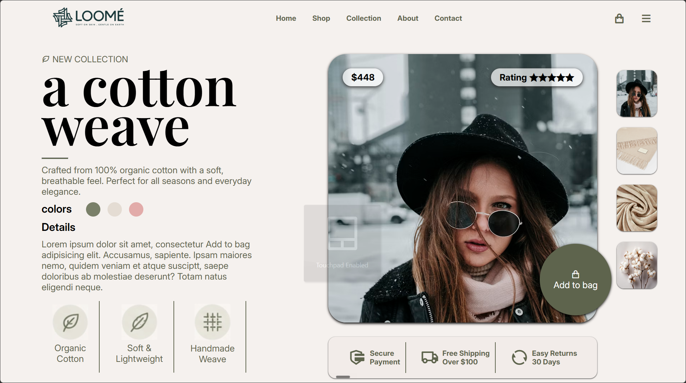

# Premium E-Commerce Interface Clone

A front-end clone of the Loomé organic cotton luxury apparel store UI given. Built as a Level 3 assignment during my cohort 3.0 at Sheryians. 

The goal of this project was to implement design mockups using structural HTML and foundational CSS layout mechanics under strict technical constraints.



---

## Technical Constraints & Implementation

This project was built strictly using the core building blocks of CSS layout architecture covered up to Level 3 of the cohort. 

* **Layout:** Implemented entirely using **CSS Flexbox** and **Explicit Positioning (`position: absolute / relative / fixed`)**. 
* **Design Limitation:** Built without using CSS Grid, external UI libraries, Bootstrap, or TailwindCSS. Every alignment, card overlay, and spacing token was coded from scratch using raw CSS.
* **Current Scope:** This is a non-responsive, non-functional static layout focusing 100% on pure UI precision, typographic scaling, and asset layering.

---

## My Key Learning Outcomes & Challenges I faced

### 1. Complex Card Overlays & Layers
- The primary challenge was layering elements dynamically over the main hero product image. I utilized absolute positioning context safely isolated within a relative container parent to mount the pricing tag (`$448`), the dynamic star rating badge, and the offset floating "Add to Bag" circular call-to-action button perfectly over the image boundaries.
- I had first used absolute positioning for the "Add to Bag", but then realized it won't work if the user changes the dimension of the screen. So, I applied relative positioning to the parent division and then applied absolute positioning to the child division and to position it outside of the parent division, then I applied negative position coordinates. 

### 2. Typographic Hierarchy & Spacing Tokens
- Achieved clean typographic balance by matching the large serif header elements (`a cotton weave`) with precisely tracked sans-serif metadata sections and standard body copy block parameters. 
- I had realised that I have used h4 tags on nav-bar thinking it was okay as I am working on the layout which it is but after searching some docs I come to know that I should have used <li> semantic tags and then <a> tags in navbar
- Also, I have used h2 before h1 in the text-content section which I found was not good practice
- I have repeated font settings many time and from this I had took learning that its better if we use it in body section and using casacdding properties of CSS I could have edited the later sections when needed. I will definetely take this learning so, next time I can work onn making my code shorter

### 3. Asymmetric Dynamic Layouts
- Managed the right-aligned layout columns (the image carousel thumbnails) and the bottom value-proposition horizontal layout blocks entirely through nested Flexbox axes to ensure exact pixel matching with the baseline design file.
CSS3:** Advanced Flexbox properties, structural alignment, custom overlay positioning coordinates

---

## 🚀 To View the Project Locally

1. Clone the repository to your workstation:
   ```bash
   git clone [https://github.com/YOUR_USERNAME/REPOS_NAME.git](https://github.com/YOUR_USERNAME/REPOS_NAME.git)
